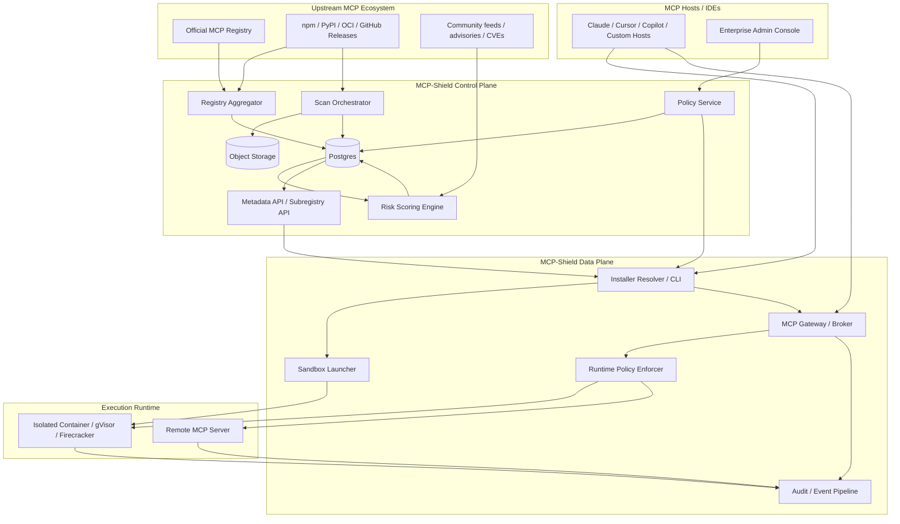
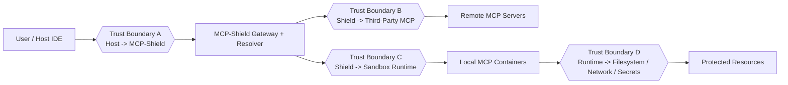
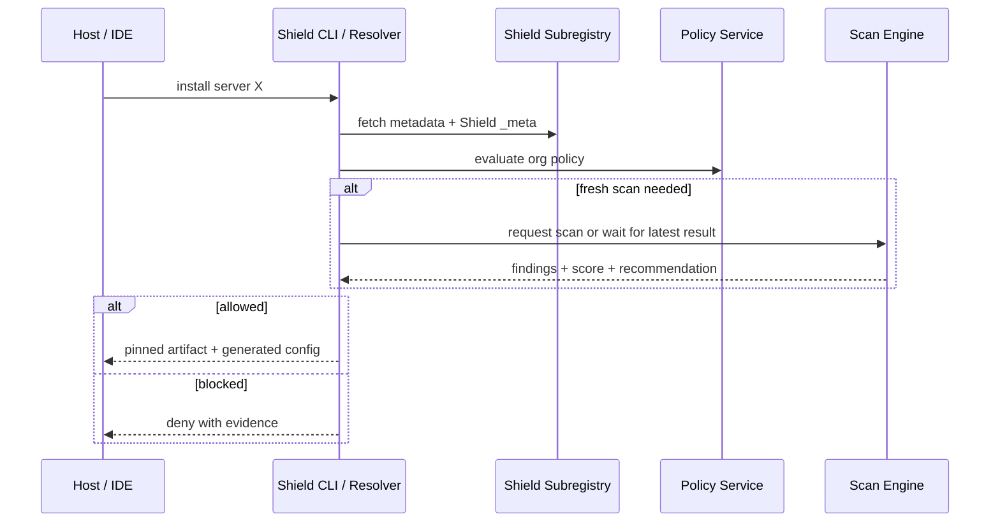
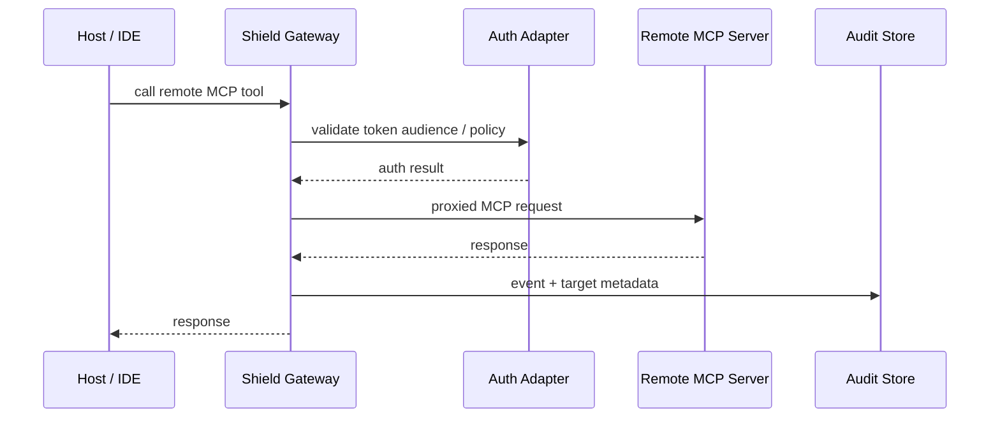
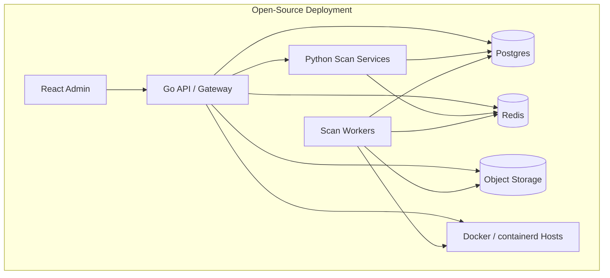

# MCP-Shield Architecture

## 1. Goals

MCP-Shield is an open-source security layer for the MCP ecosystem. It is designed to sit between MCP clients and third-party MCP servers, adding:

- registry aggregation and security metadata
- install-time verification and risk scoring
- policy enforcement for server selection and version pinning
- isolated execution for local MCP servers
- runtime auditing for local and remote MCP traffic

The project should remain protocol-compatible with the existing Model Context Protocol and should not require a fork of the MCP spec.

## 2. Product Slice

The platform is split into three planes:

1. Control plane
   - subregistry
   - policy management
   - trust metadata
   - scan orchestration

2. Data plane
   - MCP gateway / broker
   - install-time resolver
   - sandbox launcher
   - runtime authorization and audit hooks

3. Intelligence plane
   - static analyzers
   - behavior analyzers
   - reputation signals
   - risk scoring engine

This split keeps the MVP clean:

- The control plane can exist without mandatory runtime brokering.
- The data plane can be adopted incrementally by teams that only want sandboxing.
- The intelligence plane can evolve independently as rules and detectors improve.

## 3. Architecture Principles

- Protocol-first: preserve MCP compatibility for stdio, Streamable HTTP, and SSE where needed.
- Policy as code: all allow/deny/pin/sandbox rules are versioned declaratively.
- Zero trust by default: treat every third-party MCP server as untrusted until verified.
- Open-core friendly without lock-in: the OSS version must be useful standalone.
- Replaceable engines: scanners, runtimes, and reputation sources should be pluggable.
- Evidence over vibes: every risk score must link to concrete findings and artifacts.

## 4. High-Level Architecture



## 5. Trust Boundaries



Security posture by boundary:

- Boundary A
  - authenticate enterprise users and service clients
  - sign policy bundles
  - avoid local config drift

- Boundary B
  - treat all remote MCPs as potentially malicious
  - require explicit outbound policy
  - validate OAuth audience and server metadata

- Boundary C
  - isolate local servers with seccomp/AppArmor/gVisor/Firecracker when available
  - mount minimal filesystem
  - inject only scoped env vars and short-lived credentials

- Boundary D
  - enforce file, network, process, and secret access controls
  - capture immutable audit events

## 6. Core Components

### 6.1 Registry Aggregator

Responsibilities:

- sync official MCP registry entries
- ingest package metadata from npm, PyPI, OCI, and MCPB sources
- normalize package identity, version, transport, maintainer, and publish time
- expose a subregistry-compatible API with Shield-specific `_meta`

Why this matters:

- the official registry is intentionally permissive
- downstream subregistries are the natural place to add stronger moderation and scoring

Recommended implementation:

- Python service for ingestion and scan orchestration
- Postgres for normalized metadata
- Redis optional for job coordination

### 6.2 Scan Orchestrator

Responsibilities:

- fetch artifacts or metadata safely
- unpack packages in a disposable worker
- run static and supply-chain analyzers
- enqueue dynamic behavior analysis for high-risk or high-value servers

Scanner categories:

- package integrity
  - digest check
  - signature verification
  - version pinning readiness

- manifest and metadata analysis
  - suspicious install instructions
  - dangerous env requirements
  - transport type and exposure profile

- code analysis
  - shell exec
  - arbitrary file access
  - open listener exposure
  - unbounded subprocess spawning
  - outbound network libraries

- dependency and provenance analysis
  - known CVEs
  - typosquatting heuristics
  - stale maintainer / abandoned package signals

- dynamic analysis
  - filesystem writes
  - network destinations
  - child process tree
  - long-running privilege escalation behavior

Recommended implementation:

- worker queue with Celery/RQ or a Go worker pool
- each scan job runs in an ephemeral sandbox
- store findings as structured evidence, not free text

### 6.3 Risk Scoring Engine

Responsibilities:

- convert raw findings into explainable scores
- separate severity from confidence
- produce both package-level and server-level risk

Suggested score model:

- base score: 0-100
- score dimensions:
  - maliciousness confidence
  - exploitability
  - privilege sensitivity
  - supply-chain trust
  - operational maturity

Suggested classes:

- `0-24`: trusted
- `25-49`: review
- `50-74`: restricted
- `75-100`: block

The API should always return:

- numeric score
- decision class
- evidence list
- recommended sandbox profile

### 6.4 Policy Service

Responsibilities:

- define org-level allow/block/pin rules
- define sandbox profiles
- attach policies to teams, workspaces, or environments
- sign and version policy bundles

Policy examples:

- allow only registry entries with score `< 25`
- block remote servers with unknown ownership
- force container isolation for all stdio-based local servers
- permit egress only to declared domains
- pin exact package digest for production workspaces

Recommended format:

- YAML or JSON policy spec in git
- validated by JSON Schema

### 6.5 Installer Resolver / CLI

Responsibilities:

- resolve MCP install requests against Shield policies
- fetch approved versions only
- install with pinned digest or exact artifact reference
- generate host-specific config for Cursor, Claude, Copilot, or generic MCP clients

This is the fastest route to adoption because many users need safer installation before they need a full gateway.

### 6.6 MCP Gateway / Broker

Responsibilities:

- mediate traffic between hosts and approved MCP servers
- attach auth context where appropriate
- enforce runtime policy
- record request/response metadata and tool usage events

Important design choice:

- the gateway should be optional for install-only deployments
- but mandatory when teams need centralized enforcement and audit

Recommended implementation:

- Go for concurrency and transport handling
- support:
  - local stdio broker mode
  - remote Streamable HTTP proxy mode
  - selective SSE compatibility if needed

### 6.7 Sandbox Launcher

Responsibilities:

- run local MCP servers inside an isolated runtime
- mount package code, working dir, cache dir, and temp dir separately
- apply CPU, memory, process-count, and wall-clock limits
- publish runtime telemetry

Runtime options:

- MVP:
  - Docker or containerd
  - read-only root filesystem
  - bind-mount allowlist
  - egress allowlist

- hardened:
  - gVisor
  - Kata Containers
  - Firecracker microVMs for hostile workloads

### 6.8 Audit and Forensics Pipeline

Responsibilities:

- store install decisions
- store policy evaluation traces
- store runtime events and denied actions
- support replay of why a server was allowed or blocked

Recommended sinks:

- Postgres for structured events
- object storage for larger logs and artifacts
- optional OpenTelemetry export

## 7. Key Flows

### 7.1 Install-Time Resolution



### 7.2 Local Runtime Execution

```mermaid
sequenceDiagram
    participant Host as Host / IDE
    participant GW as Shield Gateway
    participant Policy as Runtime Policy
    participant Launch as Sandbox Launcher
    participant Box as Isolated MCP Server
    participant Audit as Audit Store

    Host->>GW: tools/call
    GW->>Policy: evaluate runtime policy
    Policy-->>GW: sandbox profile
    GW->>Launch: ensure sandbox running
    Launch-->>GW: endpoint / stdio bridge ready
    GW->>Box: forward MCP request
    Box-->>GW: MCP response
    GW->>Audit: request/decision/runtime events
    GW-->>Host: response
```

### 7.3 Remote Runtime Mediation



## 8. Recommended Tech Stack

Use a polyglot architecture only where it creates a clear boundary.

### Backend

- Go
  - MCP gateway
  - transport adapters
  - policy enforcement fast path
  - sandbox launcher integration

- Python
  - registry ingestion
  - artifact analysis
  - rule-based and ML-assisted scanners
  - advisory correlation

### Storage

- Postgres
  - canonical metadata
  - findings
  - policy bundles
  - audit events

- Redis
  - job queue / rate limiting / scan coordination

- S3-compatible object storage
  - raw artifacts
  - scan reports
  - large runtime logs

### Frontend

- React
  - admin console
  - findings explorer
  - policy editor
  - audit timeline

### Runtime

- Docker / containerd for MVP
- gVisor or Firecracker for hardened mode

## 9. Deployment Topology



Recommended initial deployment:

- one VM for API + gateway
- one VM for scanning workers
- managed Postgres
- local object storage or S3-compatible storage

This keeps the OSS version deployable by a small team without Kubernetes.

## 10. OSS-Friendly Repository Layout

```text
repo/
  apps/
    gateway/          # Go
    control-api/      # Go or Python API facade
    admin-web/        # React
    shield-cli/       # Go CLI
  services/
    registry-sync/    # Python
    scan-orchestrator/# Python
    analyzers/        # Python packages
  packages/
    policy-spec/      # JSON schema + examples
    sdk-go/
    sdk-python/
  deploy/
    docker-compose/
    helm/             # optional later
  docs/
    architecture.md
    threat-model.md
    policy-spec.md
    contributor-guide.md
```

## 11. MVP Scope

Build these first:

- official registry sync
- package metadata normalization
- static analyzer pipeline
- risk scoring API
- policy engine
- Shield CLI installer
- Docker-based sandbox for local stdio servers
- basic audit log viewer

Delay these:

- full dynamic malware detonation farm
- deep IDE-native plugins for every host
- Firecracker-first isolation
- ML-heavy reputation models
- enterprise SSO and multi-tenant billing

## 12. What Makes This Open Source Worth Using

The OSS version should be complete enough that a team can deploy it and gain real protection without buying a hosted service.

That means OSS must include:

- subregistry API
- scanner framework
- core analyzers
- policy engine
- CLI installer
- Docker sandbox launcher
- admin UI for findings and policies

If you ever add a commercial layer, keep it above this line:

- managed threat intel feeds
- hosted detonation infrastructure
- enterprise compliance packs
- advanced identity integration

## 13. Hard Problems You Should Explicitly Design For

- False positives
  - every block decision must be explainable and overridable

- Package identity ambiguity
  - one MCP server can map to different package ecosystems and transport styles

- Remote server trust
  - remote MCPs may change behavior without a package version change

- Secret scoping
  - many MCP servers are only dangerous because they receive broad credentials

- Transport diversity
  - stdio and HTTP transports create different isolation and auth strategies

- Performance
  - runtime brokering must not add unacceptable latency to tool calls

## 14. Recommended First Threat Model

Prioritize these attacker classes:

- malicious package publisher
- compromised maintainer account
- abandoned server taken over through dependency drift
- remote MCP operator abusing broad OAuth scopes
- prompt-injected tool description that tricks host or user
- local stdio server escaping sandbox or exfiltrating files

## 15. Alignment With Current MCP Direction

This architecture deliberately aligns with the current MCP ecosystem:

- official registry is designed to support downstream aggregators and subregistries
- subregistries can inject custom metadata such as ratings and security scan results
- the official registry uses intentionally light moderation, which creates room for stronger downstream trust layers
- modern MCP authorization guidance expects OAuth best practices, token audience validation, and avoidance of token passthrough

Reference material:

- https://modelcontextprotocol.io/registry/about
- https://modelcontextprotocol.io/registry/registry-aggregators
- https://modelcontextprotocol.io/registry/moderation-policy
- https://modelcontextprotocol.io/registry/package-types
- https://modelcontextprotocol.io/specification/2025-11-25/basic/authorization
- https://modelcontextprotocol.io/specification/draft/basic/security_best_practices

## 16. Concrete Recommendation

If you want the best chance of building this well and shipping it open source:

1. Start with a subregistry plus CLI installer.
2. Add Docker sandbox execution for local stdio servers.
3. Add the gateway only after install-time policy and scanning are stable.
4. Keep all policy logic and scan evidence explicit and inspectable.
5. Treat "security platform" as an outcome, not the first release.
